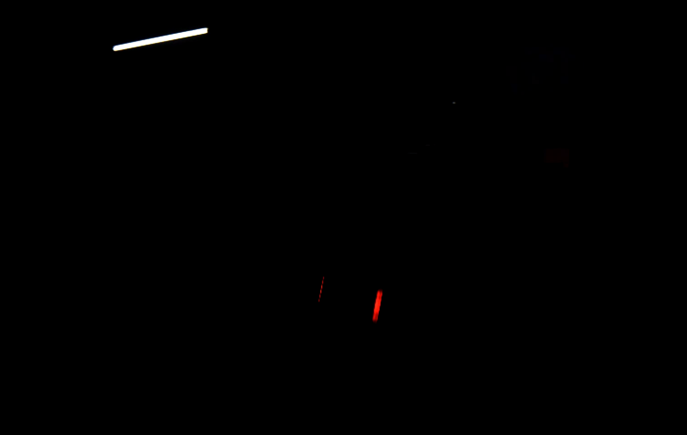
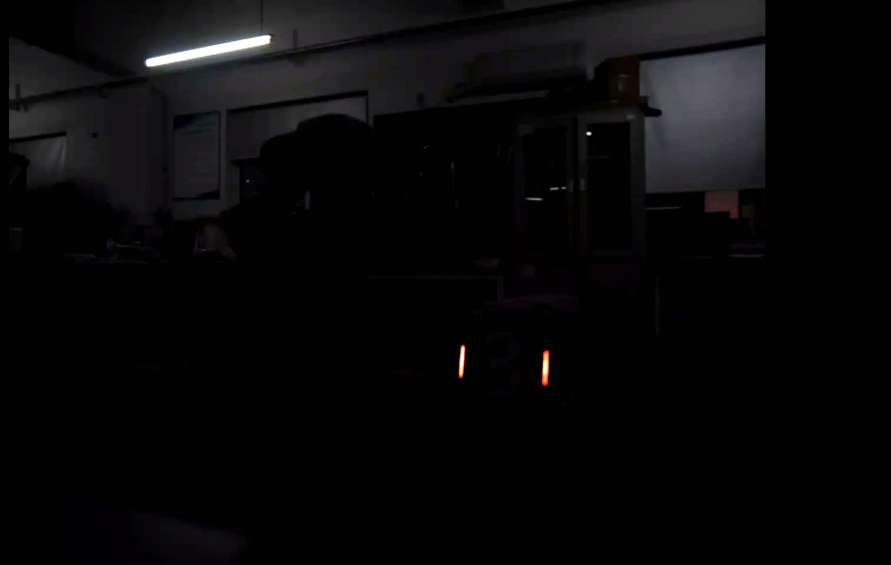

# 仓库简介
这是一个RM视觉组培训的公开仓库，主要用于记录与验收培训内容。这个仓库会详细记录每一周期的培训内容、实践项目、所遇问题与详细解决方案。  
  
目录：
- [W1](#w1) Ubuntu系统安装、编程环境配置、c++基础
- [W2](#w2) ROS2环境接入、基础通信、launch与调试
- [W3](#w3) OpenCV装甲板识别
# 周度记录
## W1
### 完成
- [x] 搭建核心操作系统Ubuntu
- [x] 装 VSCode、C/C++ 插件、build-essential、cmake、git
- [x] 在终端里确认 g++、cmake、git 可用
- [x] 写hello world cpp程序并在终端编译运行
- [x] 注册 GitHub 账号，配置本机用户名和邮箱，创建公开仓库
- [x] 学习c++函数、引用、简单类、vector / string / map相关语法
- [x] 用c++写读取命令行参数的问候程序
- [x] 配一个最小 CMakeLists.txt
- [x] 用 build/ 目录完成一次 cmake + make 编译
### 提交
- ['01_function.cpp'](W1/01_function.cpp)
- ['02_map.cpp'](W1/02_map.cpp)
- ['03_class.cpp'](W1/03_class.cpp)
- ['CMakeLists.txt'](W1/CMakeLists.txt)
- ['main.cpp'](W1/greet.cpp)
- ['命令小程序传参截图'](W1/传参截图.png)
- ['version截图'](W1/version.png)
- ['helloworld运行截图'](W1/helloworld.png)
### C++学习情况及命令行小程序说明
- 学习了c++函数、引用、简单类、vector / string / map相关语法
- 关于程序：greet程序使用标准输出 cout 流式输出问候语到终端，通过 argc 和 argv 实现简单的命令行参数解析。若未提供参数，则输出用法提示 `Usage: ./greet <name>`；若提供参数，则输出 `Hello, <name>!`
- 编译流程：
  1. `mkdir build && cd build`：在当前目录下创建一个名为 build 的子目录,进入这个 build 目录
  2. `cmake ..`:读取上一级目录里的 CMakeLists.txt，然后根据它生成 Makefile 等编译文件
  3. `make`：根据生成的 Makefile 执行编译，生成最终的可执行文件

### 问题及解决方法
- `git push` 时提示 `Problem with the SSL CA cert`  

解决方法：执行 `git config --list --show-origin | grep http.ssl`后发现Git全局配置中残留了无效的SSL证书路径,执行 `git config --global --unset http.sslcainfo` 删除该配置，证书错误消失
## W2
### 完成
- [x] ROS2环境配置
- [x] ROS2基础概念学习
- [x] 创建功能包，写talker listener节点，编译运行
- [x] 给talker加参数，参数补默认值和范围说明，跑通参数
- [x] 参数写进YAML再由launch加载
- [x] 加最小节点订阅话题并打印频率
- [x] bag record/play/info
### 提交
- ['training_pkg'](W2/training_pkg/)
- ['turtlesim运行截图'](W2/turtlesim运行截图.png)
- ['ros2_topic_list/info/echo截图'](W2/ros2_topic_list%20_info_echo%20截图.png)
- ['colcon_build截图'](W2/colcon_build成功截图.png)
- ['talker/listener同时运行截图'](W2/talker_listener同时运行截图.png)
- ['launch启动_参数生效截图'](W2/launch启动_参数生效截图.png)
- ['bag_info截图'](W2/ros2_bag_info截图.png)
- ['bag_play截图'](W2/ros2_bag_play截图.png)
- ['打印频率截图'](W2/打印频率截图.png)
### 概念说明
- `workspace`：工作空间，是一个文件夹，用于组织 ROS2 项目，里面包含`src`（存放功能包）、`build`（编译中间文件）、`install`等子目录。
- `package`：功能包，包含 CMakeLists.txt、package.xml 和 源码。
- `node`：节点，一个可执行程序，通过话题、服务等与其他节点通信。
- `topic`：话题，节点间通信的通道，发布者发布消息，订阅者接收消息。
### bag的使用
1. `启动talker`：执行`ros2 run training_pkg talker`
2. `录制`：执行`ros2 bag record /chatter` ,停止后形成rosbag文件夹
3. `查看bag信息`：执行`ros2 bag info rosbag`
4. `回放`：执行`ros2 bag play rosbag`,同时执行`ros2 run training_pkg listener`,可以看到listener正确接受并打印了录制时发布的全部消息
### 提交程序说明
本周创建了名为`ros2_ws`的工作空间，并创建了功能包`training_pkg`  
#### src
- `talker.cpp` 创建了一个发布者节点，向`/chatter`话题以固定频率发布递增的字符串消息，用于演示ros2话题通信，`频率参数设置了默认值为2,取值范围1～10`,节点根据参数值调整发布频率
- `listener.cpp` 创建了一个订阅者节点，订阅`/chatter`话题，并在终端打印接受到的消息，用于验证通信正常  
- `freq_printer.cpp` 该节点订阅`/chatter`话题，计算实时频率并每2秒打印平均频率
#### launch
使用`ros2 launch training_pkg talker-listener.launch.py`一次性启动talker和listener两个节点  
同时通过launch文件为talker节点添加了两个参数：  
- 将talker节点名重映为`my_talker`  
- 通过`YAML`参数文件加载频率参数
#### config
`talker_params.yaml`用于设置talker节点的发布频率为3Hz，在launch中通过`parameters=[params_file]`加载
### 问题及解决方法
- vscode中提示`#include错误`，无法打开源文件`rclcpp/rclcpp.hpp`  
  不影响实际编译
## W3
### 完成
- [x] 离线识别
- [x] 连续素材验证
- [x] 代码整理
- [X] 失败样例分析

### 提交
- ['red_mask'](W3/red_mask.png)
- ['blue_mask'](W3/blue_mask.png)
- ['灯条候选结果图'](W3/04_lightbars.png)
- ['装甲板几何框结果图'](W3/05_final_result.png)
- ['video_output'](W3/videos/)
- ['color_segmentation.cpp'](W3/color_segmentation.cpp)
- ['image_detector.cpp'](W3/single_image_detector.cpp)
- ['video_processor.cpp'](W3/video_processor.cpp)
- ['ArmorDetector.h'](W3/ArmorDetector.h)
- ['ArmorDetector.cpp'](W3/ArmorDetector.cpp)

### 离线识别流程
1. **图像预处理与颜色分离**  
   - 由于图片素材中灯条亮度较高，先进行 `Gamma 矫正` (gamma=2.0)
   - 将图像转换到 `HSV` 色彩空间
   - 根据红/蓝HSV阈值生成二值掩膜  
    `Red: H1=0-60 H2=170-180 S_low=0 V_low=80`  
    `Blue: H=60-110 S_low=0 V_low=140`
   - 过曝提取：对V通道进行二之值化，阈值220
   - 将红色颜色mask与过曝高亮mask`取交集`得到最终red_mask,蓝色同理
2. **灯条候选筛选**
   - 对red_mask和blue_mask分别查找轮廓
   - 按`面积(5-1000)` `长宽比(2-20)` `角度(接近竖直)` 筛选出灯条候选
   - 在原图上绘制所有灯条候选，保存中间结果`lightbars.png`
3. **灯条配对与装甲板生成**
   - 对同色灯条候选区两两配对，要求:  
     `角度差`<30   
     `高度差比例`：两灯条高度差与较大高度之比<0.6  
     `垂直偏移比例`：中心垂直距离与平均长度之比<0.8  
     `水平距离比例`:中心水平距离与平均长度之比在0.8-5.0间
   - 配对成功后，根据左右灯条的端点构造装甲板的四个点
   - 检验`装甲板宽高比`（0.7-3.5）
   - 在原图上绘制装甲板框并标注颜色，保存最终结果`final_result.png`
4. **输出调试信息**
   - 终端打印每个装甲板的`四个点坐标`和`颜色`

### 视频处理说明
使用`video_processor.cpp`依次处理6个视频  
逐帧完成装甲板检测，流程与离线识别一致，最后在原图上绘制装甲板框并标注颜色，写入输出视频  

### 如何接入ros2
将装甲板检测的完整流程封装为独立的 `ArmorDetector` 类（见 `ArmorDetector.h` 和 `ArmorDetector.cpp`）  
当前 `ArmorDetector` 类的参数还是硬编码在代码中。为了支持从 YAML 中读取参数，需要增加参数结构体和setParams() 方法，并在节点中调用  
在 ROS2 节点中使用时，需要：
1. 包含 `ArmorDetector.h`，创建 `ArmorDetector` 对象。
2. 在图像回调中，用 `cv_bridge` 将 `sensor_msgs::Image` 转为 `cv::Mat`。
3. 调用 `detect()` 得到检测结果。
4. 将结果转换为自定义消息发布到 `/armor_result` 话题；调试图像发布到 `/armor_debug_image`。

### 失败样例分析
装甲板转动角度过大时漏检

灯条亮度过高时漏检

## W4
### 完成
- [x] 真实相机取流与图像显示
- [x] 真实装甲板识别节点
- [x] 参数与launch骨架
### 提交
['armor_detector'](W4/armor_detector/)
['ros2_topic_list截图'](W4/ros2_topic_list.png)
['/armor_result截图'](W4/armor_result.png)
['调试图像'](W4/调试图象.png)
['launch启动截图'](W4/launch启动.png)
### 离线流程如何接入ros2并连接相机
- 将 W3 的离线检测流程完全封装在 `ArmorDetector 类`中
- 海康相机获取原始图像数据
- 在 `hik_camera_node` 中调用 SDK 读取图像帧，将原始 Bayer 格式数据转换为 OpenCV 的 cv::Mat，并进行 Bayer 解码得到 BGR 彩色图像
- 使用 `cv_bridge` 将 OpenCV 图像转换为 ROS2 标准消息类型 `sensor_msgs/msg/Image`
- hik_camera_node 将图像消息发布到 `/image_raw` 话题
- `armor_detector_node` 订阅 /image_raw 话题，接收相机发布的图像消息
- 检测节点使用 `cv_bridge` 将 sensor_msgs/msg/Image 转换回 OpenCV 的 cv::Mat 格式
- 调用 `ArmorDetector::detect()` 得到检测结果
- 发布结构化结果到 `/armor_result` 话题
- 发布带框的调试图像到 `/armor_debug_image` 话题
